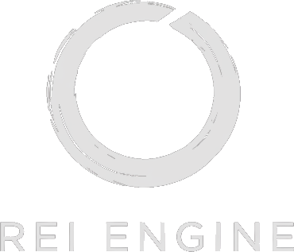
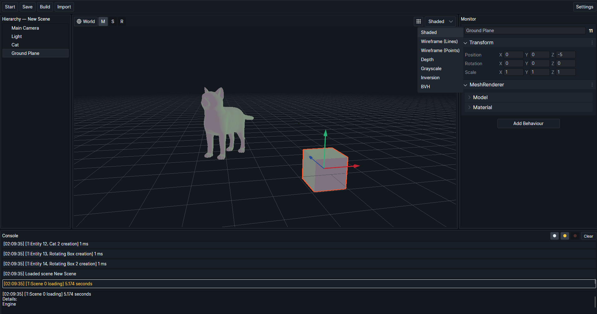

Rei Engine is a custom game engine built from scratch.
The core engine is written in **C++** with **OpenGL**, and the editor is written in **C#** with **Avalonia UI**. It targets a complete engine/editor workflow with a custom sparse-set ECS, rendering, assets, and tooling.

## Contents
- [Overview](#overview)
- [Screenshots](#screenshots)
- [Goals](#goals)
- [Tech Stack](#tech-stack)
- [Highlights](#highlights)
- [Engine Architecture (Overview)](#engine-architecture-overview)
- [Editor (Overview)](#editor-overview)
- [Rendering (Overview)](#rendering-overview)
- [Assets And Pipeline (Overview)](#assets-and-pipeline-overview)
- [Scripting And Codegen (Overview)](#scripting-and-codegen-overview)
- [Custom Sparse-Set ECS Example](#custom-sparse-set-ecs-example)
- [Tests](#tests)
- [Repository Layout](#repository-layout)
- [Build And Run](#build-and-run)
- [License](#license)

## Overview
Rei Engine is a custom C++ game engine with an OpenGL renderer and a C# Avalonia editor. It targets a complete engine/editor workflow with a custom sparse-set ECS, rendering, assets, and tooling.

## Screenshots


## Goals
- Build a full engine loop and iterate on each subsystem.
- Develop rendering pipelines, custom sparse-set ECS design, tooling, and asset workflows.
- Connect a real editor to a native runtime with live data syncing.

## Tech Stack
- **C++20** engine core
- **OpenGL 3.3+** rendering, **GLFW** window/input, **GLAD** loader
- **GLM** math, **Assimp** for model import, **stb_image** for textures
- **C# .NET 6** editor with **Avalonia UI** and **Autofac** DI

## Highlights
- Custom sparse-set ECS with fast bitmask filtering and cached query sets for efficient runtime iteration.
- Behaviour system with lifecycle hooks, serialized properties, and runtime add/remove of components.
- Editor tooling suite: hierarchy, inspector drawers, console, playmode panel, and settings workflows.
- Rendering pipeline with lighting, outlines, post-processing, gizmos, and multiple render modes.
- Asset pipeline with import/reimport, binary packing, and runtime asset refs.
- Native editor/runtime bridge enabling engine control and live entity state sync.

## Engine Architecture
Core engine systems and how they fit together at runtime: custom sparse-set ECS, scenes, input, and the main loop.
<details>
<summary><strong>Expand engine systems</strong></summary>

**Custom sparse-set ECS core**  
Entity/component registry, bitmask filters, and dirty entity tracking for fast queries.  
Keeps filter sets cached and updated as entities change, which makes iteration cheap in hot loops.  
- [EcsRegistry](Rei/src/Ecs/EcsRegistry.h)
- [Filter](Rei/src/Ecs/Filter.h)

**Behaviours**  
Components with engine lifecycle hooks and serialization support.  
Supports enable/disable, entity binding, and engine-managed lifecycle callbacks.  
- [Behaviour](Rei/src/Modules/Behaviour/Behaviour.h)

**Scene and entity management**  
Persistent scene assets and runtime entity creation.  
Scene entities are tracked with stable IDs and can be loaded and rebuilt on demand.  
- [Scene](Rei/src/Modules/Scenes/Scene.h)
- [EntityManager](Rei/src/Modules/EntityManagement/EntityManager.h)

**Input and windows**  
GLFW input abstraction and window manager.  
Unified keyboard/mouse state tracking with per-frame transitions for edge-triggered input.  
- [Input](Rei/src/Modules/Input/Input.h)
- [WindowManager](Rei/src/Modules/Window/WindowManager.h)

**Logging and utilities**  
Scoped logging, timers, and error utilities.  
Scoped timers help measure hotspots; logging is structured and scoped for engine subsystems.  
- [Log](Rei/src/Common/Logging/Log.h)
- [ScopedTimer](Rei/src/Common/Time/ScopedTimer.h)

**Engine loop and services**  
Engine lifecycle with service locator pattern.  
Centralized services keep runtime modules synchronized and accessible across systems.  
- [Engine](Rei/src/Engine/Engine.h)
- [Services](Rei/src/Engine/Services.h)

</details>

## Editor
The Avalonia editor provides project management, inspection, playmode control, and runtime sync.
<details>
<summary><strong>Expand editor features</strong></summary>

**Project management**  
Project creation, templates, and setup workflows.  
Generates solution scaffolding and keeps project metadata in sync.  
- [ProjectManagement](ReiEditor/Models/ProjectManagement)
- [ProjectTemplates](ReiEditor/Resources/ProjectTemplates)

**Inspector / Monitor**  
Property drawers for primitives, enums, vectors, colors, and custom types.  
Auto-generates UI from serialized properties for fast iteration on components.  
- [Monitor Views](ReiEditor/Views/Windows/Editor/Monitor)
- [Monitor ViewModels](ReiEditor/ViewModels/Windows/Editor/Monitor)

**Hierarchy**  
Entity tree with selection and reordering.  
Selection links directly to the inspector and playmode highlighting.  
- [Hierarchies](ReiEditor/Views/Windows/Editor/Hierarchies)

**Console**  
Runtime + editor log output with filtering.  
Aggregates editor logs and engine logs in one place for debugging.  
- [Console](ReiEditor/Views/Windows/Editor/Console)

**Playmode panel**  
Start/stop runtime, render mode selection, transformation space.  
Switches between editor and play modes while preserving scene state.  
- [Playmode](ReiEditor/Views/Windows/Editor/Playmode)

**Engine runtime bridge**  
Editor calls into native DLL and syncs entity state.  
Live property edits push into the runtime and reflect back into the editor.  
- [Engine Services](ReiEditor/Models/Services/Engine)
- [EntityStateSynchronizer](ReiEditor/Models/Services/Entities/EntityStateSynchronizer.cs)

</details>

## Rendering
Renderer and pipeline stages: lighting, outlines, post-processing, gizmos, and debug modes.
<details>
<summary><strong>Expand rendering pipeline</strong></summary>

**Render scenario pipeline**  
Multiple passes and modes.  
Supports forward passes, depth-only rendering, and editor overlays.  
- [DefaultRenderScenario](Rei/src/Modules/Render/RenderScenario/DefaultRenderScenario.cpp)

**Lighting**  
Ambient + point lights with shader uniforms.  
Point lights are collected per-frame and pushed to shaders in a single pass.  
- [LightingRenderModule](Rei/src/Modules/Render/Modules/LightingRenderModule.h)

**Post-processing**  
Grayscale, inversion, overlay texture.  
Chainable effects rendered through a fullscreen quad.  
- [PostProcessingModule](Rei/src/Modules/Render/Modules/PostProcessingModule.h)
- [Post Processing Shaders](Rei/resources/shaders/post_processing)

**Outline pass**  
Selection outline rendering.  
Selection highlights render in a separate buffer and composited post-pass.  
- [OutlineRenderModule](Rei/src/Modules/Render/Modules/OutlineRenderModule.h)

**Gizmos and grid**  
Editor visualization helpers.  
Draws helpers for transforms, selection bounds, and scene orientation.  
- [Gizmos](Rei/src/Modules/Render/Modules/Gizmos.h)
- [GridRenderModule](Rei/src/Modules/Render/Modules/GridRenderModule.h)

**BVH render mode**  
Visualize mesh BVH for debugging.  
Lets you inspect mesh spatial partitioning and ray intersection paths.  
- [BVHRenderModule](Rei/src/Modules/Render/Modules/BVHRenderModule.h)
- [MeshBVHNode](Rei/src/Modules/Render/Mesh/MeshBVHNode.h)

**Custom shader system**  
Include files and compile utilities.  
Custom .rshader format supports shared includes and runtime compilation.  
- [Shader](Rei/src/Modules/Render/Shaders/Shader.cpp)

</details>

## Assets And Pipeline
Asset import, binary packing, and editor-driven build flow for runtime-ready resources.
<details>
<summary><strong>Expand asset pipeline</strong></summary>

**Asset references**  
Runtime `AssetRef<T>` handles and lazy loading.  
Asset refs behave like handles and are resolved at load time.  
- [AssetRef](Rei/src/Modules/Assets/AssetRef.h)

**Binary asset packing**  
Asset map with offsets and serialized resources.  
Multiple assets are packed into a single binary with an offset table.  
- [AssetsMap](Rei/src/Modules/Assets/AssetsMap.h)
- [BinaryWriter](Rei/src/Modules/Resources/Serialization/BinaryWriter.h)

**Texture and model builders**  
`.png/.jpg/.obj/.fbx` support.  
Supports conversion to internal formats with metadata and serialized blobs.  
- [TextureBuilder](Rei/src/Modules/Resources/Builders/TextureBuilder.cpp)
- [ModelBuilder](Rei/src/Modules/Resources/Builders/ModelBuilder.cpp)

**Editor-driven build**  
Asset import, meta files, and build pipeline.  
The editor handles reimport, meta generation, and build orchestration.  
- [AssetImporter](ReiEditor/Models/Services/Assets/AssetImporter.cs)
- [AssetBuilder (Editor)](ReiEditor/Models/Services/Build/Assets/AssetBuilder.cs)

</details>

## Scripting And Codegen
Custom macros and tooling that keep engine code and editor data in sync.
<details>
<summary><strong>Expand scripting and code generation</strong></summary>

**Behaviour macros**  
Macros define serializable fields and hook them into the editor pipeline.  
- [Core Macros](Rei/src/Core.h)

**Source parsing**  
Parses headers to extract serialized properties and custom enums.  
- [SourceFilesUtility](ReiEditor/Models/Services/Assets/Scripting/SourceFilesUtility.cs)

**Registry codegen**  
Generated C++ sources wire behaviours into add/get/set paths at runtime.  
- [BehaviourRegistrySourceGenerator](ReiEditor/Models/Services/Assets/Scripting/BehaviourRegistrySourceGenerator.cs)

</details>

## Custom Sparse-Set ECS Example
A tiny example showing how entities, components, and filters look in the custom sparse-set ECS.

```cpp
#include "Ecs/World.h"
#include "Ecs/Ecs.h"

struct Position { float x, y, z; };
struct Velocity { float x, y, z; };

void Example()
{
    rei::ecs::World world;
    ECS_WORLD(world);

    auto e = NEW_ENTITY();
    GET(e, Position) = {0, 0, 0};
    GET(e, Velocity) = {1, 0, 0};

    world.Refresh();

    auto& moving = FILTER(Position, Velocity);
    FOR(entity, moving)
    {
        auto& pos = GET(entity, Position);
        auto& vel = GET(entity, Velocity);
        pos.x += vel.x;
    }
}
```

## Repository Layout
High-level map of the engine, editor, and sample projects.
<details>
<summary><strong>Expand project structure</strong></summary>

**C++ engine core**  
The main engine runtime, systems, and modules.  
- [Rei](Rei)

**Engine sources, resources, and tests**  
Source code, built-in assets, and unit tests are grouped here.  
- [Rei/src](Rei/src)
- [Rei/resources](Rei/resources)
- [Rei/tests](Rei/tests)

**C# Avalonia editor**  
Editor UI, MVVM layers, and tools live here.  
- [ReiEditor](ReiEditor)
- [ReiEditor/Views](ReiEditor/Views)
- [ReiEditor/ViewModels](ReiEditor/ViewModels)
- [ReiEditor/Models](ReiEditor/Models)

**Sample game scripts and runtime app**  
Sandbox app and example gameplay scripts.  
- [ReiSandbox](ReiSandbox)

</details>

## Build And Run
### Requirements
- Windows
- Visual Studio 2022 (MSVC v143)
- CMake 3.22+

### CMake (Recommended)
Use the root `CMakePresets.json`:

```bash
cmake --preset vs2022-debug
cmake --build --preset vs2022-debug-rei
cmake --build --preset vs2022-debug-sandbox
```

Build output:
- Engine DLL: `out/build/vs2022-debug/Rei/Debug/Rei.dll`
- Sandbox app: `out/build/vs2022-debug/ReiSandbox/Debug/ReiSandbox.exe`

### MSBuild (Legacy / Existing)
```powershell
& "C:\Program Files\Microsoft Visual Studio\2022\Community\MSBuild\Current\Bin\amd64\MSBuild.exe" `
  Rei.sln "/t:Rei;ReiSandbox" /p:Configuration=Debug /p:Platform=x64 /m:1
```

### Notes
- Third-party binaries are currently resolved from the repository (`Rei/external/...`).
- `ReiSandbox/Internal/BehaviourRegistry.cpp` is generated and may contain machine-specific include paths, depending on generation context.

## License
Licensed under the Apache License 2.0.  
Files:
- [LICENSE](LICENSE)
- [NOTICE](NOTICE)
