# ReiEditor MCP bridge

## Purpose

ReiEditor exposes a local Model Context Protocol server so an AI client can inspect and control the same project state that the editor UI uses.

Current implementation is a first production-shaped vertical slice. It proves transport, lifecycle, thread safety, tool contracts, editor integration, and persistence flow before broader scene and asset automation is added.

## Architecture

```mermaid
flowchart LR
    Client["MCP client\nCodex or test client"]
    Host["ReiEditor.Mcp\nStreamable HTTP host"]
    Tools["Typed MCP tools"]
    Gateway["IReiEditorGateway"]
    Dispatcher["Avalonia UI dispatcher"]
    Session["Current EditorScope session"]
    Services["Scene, entity, engine, asset services"]

    Client -->|"127.0.0.1:18777/mcp"| Host
    Host --> Tools
    Tools --> Gateway
    Gateway --> Dispatcher
    Dispatcher --> Session
    Session --> Services
```



### Project boundaries

`ReiEditor.Mcp`

- Owns MCP SDK dependency, Streamable HTTP host, tool metadata, public contracts, and safe MCP errors.
- Has no Avalonia, Autofac, Rei scene model, or native engine dependency.
- Can be integration-tested with a fake editor gateway.

`ReiEditor`

- Implements `IReiEditorGateway` using existing business services.
- Marshals every project and scene operation onto Avalonia UI thread.
- Attaches an editor session when `EditorScope` exists and detaches it when that scope is disposed.
- Owns server startup and shutdown through application scope.

`ReiEditor.Mcp.Tests`

- Starts a real loopback Kestrel server on an ephemeral port.
- Connects through official C# MCP client using Streamable HTTP.
- Verifies tool discovery, successful calls, mutations, safe errors, health endpoint, and Host-header rejection.

## Why Streamable HTTP

ReiEditor is a long-lived GUI application. MCP client does not own editor process, so stdio child-process transport is a poor lifecycle match. Embedded Streamable HTTP lets client reconnect while editor keeps project, scene, native engine, and imported assets alive.

Server is stateless at MCP transport level. Editor state remains in ReiEditor and is accessed through gateway on every request.

## Lifecycle

1. ReiEditor application scope creates gateway and starts MCP host.
2. Server begins accepting requests even on project-management screen.
3. Opening a project creates `EditorScope` and attaches one `IMcpEditorSession`.
4. Tools report `project_loading` until current scene exists.
5. Ready session reports `ready` and accepts scene operations.
6. Disposing `EditorScope` detaches session before its services disappear.
7. Application scope disposal stops Kestrel and active MCP requests.

Host failure does not crash editor. Error is written through ReiEditor logger and editor continues without MCP.

## Endpoint and configuration

Default MCP endpoint:

```text
http://127.0.0.1:18777/mcp
```

Health endpoint:

```text
http://127.0.0.1:18777/health
```

Environment variables:

| Variable | Default | Meaning |
| --- | --- | --- |
| `REI_MCP_ENABLED` | `true` | Set `false` to disable server. |
| `REI_MCP_PORT` | `18777` | Loopback TCP port, `1..65535`. |

Bind address and MCP path are intentionally not configurable. First version cannot be exposed to LAN accidentally.

Connect current Codex CLI:

```powershell
codex mcp add rei-editor --url http://127.0.0.1:18777/mcp
```

Editor must be running before client uses tools. Reconnect or start a new Codex task after changing MCP registration.

## Security and consistency rules

- Kestrel binds only to `127.0.0.1`.
- Middleware accepts only `127.0.0.1` and `localhost` Host headers, blocking DNS-rebinding style access.
- CORS is not enabled.
- Tool inputs are untrusted. Gateway validates ids, readiness, names, and operation state.
- Model exceptions are converted to explicit safe codes such as `entity_not_found`; arbitrary internal exceptions are not exposed.
- All editor model access runs on Avalonia UI thread.
- Mutations never save implicitly. Agent can batch changes, inspect result, then call explicit save tool.
- Save is rejected during play mode, build, or another save.

Loopback is not an authorization boundary against other local processes. Add authentication before any future non-loopback transport.

## Tools

| Tool | Mode | Result |
| --- | --- | --- |
| `rei_editor_get_state` | Read-only | Project-management/loading/ready status, active project, scene, engine. |
| `rei_editor_list_entities` | Read-only | Current hierarchy in display order with ids, parent/order/depth, behaviours. |
| `rei_editor_get_entity` | Read-only | Entity behaviours and normalized JSON-compatible property values. |
| `rei_editor_rename_entity` | Mutation, idempotent | Renames through existing entity command; requires explicit save. |
| `rei_editor_save_project` | Mutation, idempotent | Syncs scene from engine, then saves dirty project assets. |

Recommended agent flow:

1. Call `rei_editor_get_state`.
2. Wait if status is `project_loading`; ask user to open project if status is `project_management`.
3. Call `rei_editor_list_entities` and use stable entity ids.
4. Inspect target with `rei_editor_get_entity`.
5. Perform mutations.
6. Re-read affected state.
7. Call `rei_editor_save_project` only when result is accepted.

## Build and tests

```powershell
dotnet build C:\Repos\Rei\ReiEditor\ReiEditor.csproj -c Debug -p:Platform=x64
dotnet test C:\Repos\Rei\ReiEditor.Mcp.Tests\ReiEditor.Mcp.Tests.csproj -c Debug
```

Transport tests use port `0`, letting Kestrel allocate an unused port. Production editor always uses configured fixed port.

## Adding a tool

1. Add transport-neutral input/output contract in `ReiEditor.Mcp/Contracts`.
2. Extend `IReiEditorGateway` with one editor capability.
3. Implement capability in ReiEditor adapter using existing business service, not ViewModel or Autofac service locator.
4. Route model access through `IEditorThreadDispatcher`.
5. Add annotated method to `ReiEditorMcpTools` with accurate read-only, destructive, idempotent, and open-world metadata.
6. Validate input explicitly and throw `ReiMcpOperationException` with safe code/message for expected failures.
7. Add real-transport integration test and editor build verification.

## Next iterations

Priority order:

1. Typed behaviour-property write, including vectors, colors, collections, and exact symbol-cell control.
2. Create/delete/reparent entity with explicit destructive metadata and postcondition snapshots.
3. Scene list/load/create tools and scene resources.
4. Asset lookup/import/build status and project build operations.
5. Editor viewport capture and diagnostics resources.
6. Optional request authentication if transport scope expands beyond loopback.

Avoid generic `execute_command` or reflection-based “call any editor method” tools. Narrow contracts remain understandable, testable, and safe as editor grows.
