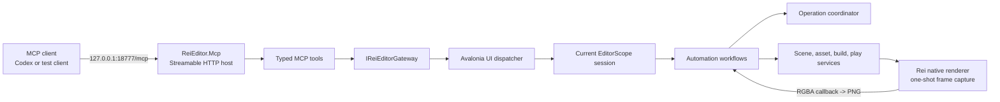

# ReiEditor MCP bridge

## Purpose

ReiEditor exposes local Model Context Protocol server so automation client can inspect and control same project state used by Editor UI.

Bridge supports closed project iteration loop:

```text
edit files -> refresh/import -> build -> play -> capture frame -> inspect logs -> repeat
```

Bridge does not replace native engine or Editor builds. It automates project lifecycle inside already-running Editor.

## Engine, Editor, and Project boundaries

| Layer | Typical changes | Build/restart boundary |
| --- | --- | --- |
| `Rei` | Native API, renderer, engine systems | Build `Rei`, then `ReiSandbox` sequentially. Restart Editor before using changed native DLL/API. |
| `ReiEditor` and `ReiEditor.Mcp` | Editor workflows, gateway, MCP tools | Build `ReiEditor`. Restart Editor so embedded MCP host loads changed assemblies. |
| Game project | Scripts, assets, scenes, shaders | Use MCP refresh/build/play/capture loop. Editor stays open. |

Project build tool invokes existing Editor pipeline. It reimports assets, validates sources, builds project solution and/or assets, updates build cache, and uses staged Editor DLL promotion where required.

## Architecture



### Project boundaries

`ReiEditor.Mcp`

- Owns MCP SDK dependency, Streamable HTTP host, tool metadata, public contracts, and safe MCP errors.
- Has no Avalonia, Autofac, Rei scene model, or native engine dependency.
- Can be integration-tested with fake Editor gateway.

`ReiEditor`

- Implements `IReiEditorGateway` using existing business services.
- Marshals request entry onto Avalonia UI thread.
- Attaches one session while `EditorScope` exists and detaches it on scope disposal.
- Separates scene session adapter from automation orchestration.
- Owns async operation coordinator, operation-scoped logs, and PNG encoding.
- Calls existing import, build, save, and playmode services; MCP does not duplicate those pipelines.

`Rei`

- Accepts one thread-safe frame-capture request.
- Reads final framebuffer on render thread after post-processing, UI, and debug overlay.
- Returns top-left-oriented RGBA bytes through stable native callback.
- Completes pending capture with failure during renderer disposal.

`ReiEditor.Mcp.Tests`

- Starts real loopback Kestrel server on ephemeral port.
- Connects through official C# MCP client using Streamable HTTP.
- Verifies all tool discovery, annotations, structured calls, image content, safe errors, health endpoint, and Host-header rejection.

## Why Streamable HTTP

ReiEditor is long-lived GUI application. MCP client does not own Editor process, so stdio child-process transport is poor lifecycle match. Embedded Streamable HTTP lets client reconnect while Editor keeps project, scene, native engine, and imported assets alive.

Server is stateless at MCP transport level. Editor state remains in ReiEditor and is read through gateway on every request.

## Lifecycle

1. ReiEditor application scope creates gateway and starts MCP host.
2. Server accepts requests on project-management screen.
3. Opening project creates `EditorScope` and attaches one `IMcpEditorSession`.
4. Tools report `project_loading` until current scene exists.
5. Ready session reports project, scene, engine, import, build, and active-operation state.
6. Disposing `EditorScope` detaches session and cancels active automation operation.
7. Application scope disposal stops Kestrel and active MCP requests.

Host failure does not crash Editor. Error is written through ReiEditor logger; Editor continues without MCP.

## Endpoint and configuration

Default MCP endpoint:

```text
http://127.0.0.1:18777/mcp
```

Health endpoint:

```text
http://127.0.0.1:18777/health
```

| Variable | Default | Meaning |
| --- | --- | --- |
| `REI_MCP_ENABLED` | `true` | Set `false` to disable server. |
| `REI_MCP_PORT` | `18777` | Loopback TCP port, `1..65535`. |

Bind address and MCP path are intentionally fixed. Current bridge cannot be exposed to LAN accidentally.

Connect Codex CLI:

```powershell
codex mcp add rei-editor --url http://127.0.0.1:18777/mcp
```

Editor must be running before client uses tools. Reconnect client after changing MCP registration. Restart Editor after rebuilding Editor or native engine.

## Security and consistency rules

- Kestrel binds only to `127.0.0.1`.
- Middleware accepts only `127.0.0.1` and `localhost` Host headers.
- CORS is disabled.
- Inputs are untrusted. Gateway validates ids, readiness, names, build options, log filters, and operation state.
- Expected failures use safe codes such as `entity_not_found`, `operation_in_progress`, and `capture_unavailable`.
- Arbitrary internal exception details are not returned through MCP.
- Editor model entry runs on Avalonia UI thread.
- Only one refresh/build/play/stop automation operation can be active per Editor session.
- Entity mutation never saves implicitly. Save remains explicit.
- Save is rejected during active automation operation, play mode, build, or another save.
- Loopback is not authorization against other local processes. Add authentication before any non-loopback transport.

## Tools

| Tool | Mode | Result |
| --- | --- | --- |
| `rei_editor_get_state` | Read-only | Project-management/loading/ready status plus project, scene, engine, import, build, and active operation. |
| `rei_editor_list_entities` | Read-only | Current hierarchy in display order with ids, parent/order/depth, and behaviours. |
| `rei_editor_get_entity` | Read-only | Entity behaviours and normalized JSON-compatible property values. |
| `rei_editor_rename_entity` | Mutation, idempotent | Renames through existing entity command; requires explicit save. |
| `rei_editor_save_project` | Mutation, destructive, idempotent | Syncs scene from engine, then saves dirty project assets. |
| `rei_editor_refresh_assets` | Mutation, destructive, idempotent | Starts full reimport, meta cleanup/update, behaviour refresh, shader refresh, and scene import. |
| `rei_editor_start_build` | Mutation, destructive, idempotent | Starts Editor project build pipeline. |
| `rei_editor_start_playmode` | Mutation, idempotent | Saves, performs incremental `EditorDebug` build, and starts play mode. |
| `rei_editor_stop_playmode` | Mutation, idempotent | Stops play mode; existing lifecycle restores Editor mode. |
| `rei_editor_get_operation` | Read-only | Returns operation status, progress, timestamps, log count, and safe error. |
| `rei_editor_cancel_operation` | Mutation, idempotent | Requests cooperative cancellation. Non-cancelable phase may finish first. |
| `rei_editor_get_logs` | Read-only | Returns current console snapshot or retained logs for one operation. |
| `rei_editor_capture_frame` | Read-only, non-idempotent | Returns frame metadata plus direct `image/png` MCP content. |

### Build options

Configurations:

- `debug`
- `editor_debug`
- `release`
- `editor_release`

Options control solution build, asset build, forced solution rebuild, clean solution build, and forced asset rebuild. Clean solution build implies solution rebuild. At least solution or assets must be enabled.

### Operation model

Start tools return immediately with operation id. Poll `rei_editor_get_operation` until status becomes terminal:

- `succeeded`
- `failed`
- `canceled`

One conflicting automation operation is allowed at time. Completed operation data remains available for current Editor session. Last 20 operations are retained; each keeps up to 1000 bounded log records. Operation logs survive successful build console clearing.

Cancellation is cooperative. Import has no cancellable internal API, so refresh notices cancellation after current import phase. Build propagates cancellation into solution build and supported phases. Canceled playmode startup schedules engine stop if native startup already began.

## Recommended iteration flow

1. Call `rei_editor_get_state`; require `ready` and no active operation.
2. Edit project files.
3. Start `rei_editor_refresh_assets` and poll returned id.
4. On failure, read `rei_editor_get_logs` with operation id and fix issue.
5. Start `rei_editor_start_build` using `editor_debug`; poll and inspect logs.
6. Start `rei_editor_start_playmode`; incremental build should reuse current build state.
7. Poll until play mode started.
8. Call `rei_editor_capture_frame`; inspect returned PNG directly.
9. Read engine/editor logs, filtered by level when useful.
10. Stop play mode, edit, and repeat.

For quick visual iteration, separate explicit build may be skipped because `rei_editor_start_playmode` already saves and runs incremental `EditorDebug` build.

## Build and tests

```powershell
$msbuild = "C:\Program Files\Microsoft Visual Studio\18\Community\MSBuild\Current\Bin\amd64\MSBuild.exe"

# Editor and embedded MCP
& $msbuild C:\Repos\Rei\ReiEditor\ReiEditor.csproj /t:Build /p:Configuration=Debug /p:Platform=x64

dotnet test C:\Repos\Rei\ReiEditor.Mcp.Tests\ReiEditor.Mcp.Tests.csproj -c Debug -p:Platform=x64

# Native changes: always sequential
& $msbuild C:\Repos\Rei\Rei.sln /t:Rei /p:Configuration=Debug /p:Platform=x64 /m:1
& $msbuild C:\Repos\Rei\Rei.sln /t:ReiSandbox /p:Configuration=Debug /p:Platform=x64 /m:1
```

Transport tests use port `0`; Kestrel selects unused port. Production Editor uses configured fixed port.

## Adding tool

1. Add transport-neutral input/output contract under `ReiEditor.Mcp/Contracts`.
2. Extend `IReiEditorGateway` with one narrow Editor capability.
3. Implement it in ReiEditor adapter using existing business service, not ViewModel or Autofac service locator.
4. Route Editor model entry through `IEditorThreadDispatcher`.
5. Use operation coordinator for long-running conflicting mutation.
6. Add annotated method to `ReiEditorMcpTools` with accurate read-only, destructive, idempotent, and open-world metadata.
7. Validate input and throw `ReiMcpOperationException` with safe code/message for expected failure.
8. Add real-transport integration test and required Editor/native build verification.

Avoid generic `execute_command` and reflection-based “call any Editor method” tools. Narrow contracts remain understandable, testable, and safe.

## Next iterations

1. Typed behaviour-property writes, including vectors, colors, collections, and exact symbol-cell control.
2. Create/delete/reparent entity with explicit destructive metadata and postcondition snapshots.
3. Scene list/load/create tools and scene resources.
4. Optional capture parameters: target size, scene-only/UI inclusion, and named artifact persistence.
5. Structured build diagnostics beyond log records.
6. Optional request authentication if transport expands beyond loopback.
