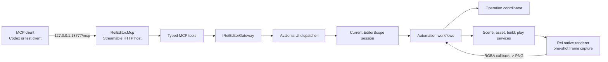

# ReiEditor MCP bridge

## Purpose

ReiEditor exposes local Model Context Protocol server so automation client can inspect and control same project state used by Editor UI.

Bridge supports closed project iteration loop:

```text
edit files -> refresh/import -> build -> play -> capture frame -> inspect logs -> repeat
```

Bridge does not replace native engine or Editor builds. It automates project lifecycle inside already-running Editor.

## Engine, Editor, and Project boundaries

| Layer | Typical changes | Build/restart boundary |
| --- | --- | --- |
| `Rei` | Native API, renderer, engine systems | Build `Rei`, then `ReiSandbox` sequentially. Restart Editor before using changed native DLL/API. |
| `ReiEditor` and `ReiEditor.Mcp` | Editor workflows, gateway, MCP tools | Build `ReiEditor`. Restart Editor so embedded MCP host loads changed assemblies. |
| Game project | Scripts, assets, scenes, shaders | Use MCP refresh/build/play/capture loop. Editor stays open. |

Project build tool invokes existing Editor pipeline. It reimports assets, validates sources, builds project solution and/or assets, updates build cache, and uses staged Editor DLL promotion where required.

## Architecture


```mermaid
flowchart LR
    Client["MCP client\nCodex or test client"]
    Host["ReiEditor.Mcp\nStreamable HTTP host"]
    Tools["Typed MCP tools"]
    Gateway["IReiEditorGateway"]
    Dispatcher["Avalonia UI dispatcher"]
    Session["Current EditorScope session"]
    Automation["Automation workflows"]
    Coordinator["Operation coordinator"]
    Services["Scene, asset, build, play services"]
    Native["Rei native renderer\none-shot frame capture"]

    Client -->|"127.0.0.1:18777/mcp"| Host
    Host --> Tools
    Tools --> Gateway
    Gateway --> Dispatcher
    Dispatcher --> Session
    Session --> Automation
    Automation --> Coordinator
    Automation --> Services
    Services --> Native
    Native -->|"RGBA callback -> PNG"| Automation
```

### Project boundaries

`ReiEditor.Mcp`

- Owns MCP SDK dependency, Streamable HTTP host, tool metadata, public contracts, and safe MCP errors.
- Has no Avalonia, Autofac, Rei scene model, or native engine dependency.
- Can be integration-tested with fake Editor gateway.

`ReiEditor`

- Implements `IReiEditorGateway` using existing business services.
- Marshals request entry onto Avalonia UI thread.
- Attaches one session while `EditorScope` exists and detaches it on scope disposal.
- Separates scene session adapter from automation orchestration.
- Owns async operation coordinator, operation-scoped logs, and PNG encoding.
- Calls existing import, build, save, and playmode services; MCP does not duplicate those pipelines.

`Rei`

- Accepts one thread-safe frame-capture request.
- Reads final framebuffer on render thread after post-processing, UI, and debug overlay.
- Returns top-left-oriented RGBA bytes through stable native callback.
- Completes pending capture with failure during renderer disposal.

`ReiEditor.Mcp.Tests`

- Starts real loopback Kestrel server on ephemeral port.
- Connects through official C# MCP client using Streamable HTTP.
- Verifies all tool discovery, annotations, structured calls, image content, safe errors, health endpoint, and Host-header rejection.

## Why Streamable HTTP

ReiEditor is long-lived GUI application. MCP client does not own Editor process, so stdio child-process transport is poor lifecycle match. Embedded Streamable HTTP lets client reconnect while Editor keeps project, scene, native engine, and imported assets alive.

Server is stateless at MCP transport level. Editor state remains in ReiEditor and is read through gateway on every request.

## Lifecycle

1. ReiEditor application scope creates gateway and starts MCP host.
2. Server accepts requests on project-management screen.
3. Opening project creates `EditorScope` and attaches one `IMcpEditorSession`.
4. Tools report `project_loading` until current scene exists.
5. Ready session reports project, scene, engine, import, build, and active-operation state.
6. Disposing `EditorScope` detaches session and cancels active automation operation.
7. Application scope disposal stops Kestrel and active MCP requests.

Host failure does not crash Editor. Error is written through ReiEditor logger; Editor continues without MCP.

## Endpoint and configuration

Default MCP endpoint:

```text
http://127.0.0.1:18777/mcp
```

Health endpoint:

```text
http://127.0.0.1:18777/health
```

| Variable | Default | Meaning |
| --- | --- | --- |
| `REI_MCP_ENABLED` | `true` | Set `false` to disable server. |
| `REI_MCP_PORT` | `18777` | Loopback TCP port, `1..65535`. |

Bind address and MCP path are intentionally fixed. Current bridge cannot be exposed to LAN accidentally.

Connect Codex CLI:

```powershell
codex mcp add rei-editor --url http://127.0.0.1:18777/mcp
```

Editor must be running before client uses tools. Reconnect client after changing MCP registration. Restart Editor after rebuilding Editor or native engine.

## Security and consistency rules

- Kestrel binds only to `127.0.0.1`.
- Middleware accepts only `127.0.0.1` and `localhost` Host headers.
- CORS is disabled.
- Inputs are untrusted. Gateway validates ids, readiness, entity and behaviour names, serialized property names and value shapes, build options, log filters, and operation state.
- Behaviour mutations resolve registered types by name, reject missing properties and incompatible values, and verify add postconditions.
- Material mutations resolve registered shader uniforms, reuse Inspector conversion, validate texture asset references, and synchronize loaded runtime data.
- Expected failures use safe codes such as `entity_not_found`, `operation_in_progress`, and `capture_unavailable`.
- Arbitrary internal exception details are not returned through MCP.
- Editor model entry runs on Avalonia UI thread.
- Only one refresh/build/play/stop automation operation can be active per Editor session.
- Entity mutation never saves implicitly. Save remains explicit.
- Save is rejected during active automation operation, play mode, build, or another save.
- Loopback is not authorization against other local processes. Add authentication before any non-loopback transport.

## Tools

| Tool | Mode | Result |
| --- | --- | --- |
| `rei_editor_get_state` | Read-only | Project-management/loading/ready status plus project, scene, engine, import, build, and active operation. |
| `rei_editor_list_entities` | Read-only | Current hierarchy in display order with ids, parent/order/depth, and behaviours. |
| `rei_editor_get_entity` | Read-only | Entity behaviours and normalized JSON-compatible property values. |
| `rei_editor_rename_entity` | Mutation, idempotent | Renames through existing entity command; requires explicit save. |
| `rei_editor_add_behaviour` | Mutation, idempotent | Adds registered Behaviour by type name. Existing attachment is unchanged success. |
| `rei_editor_set_behaviour_property` | Mutation, idempotent | Sets primitive, collection, or partial custom serialized value. Asset refs use `{"Id":"asset-guid"}`. |
| `rei_editor_set_material_property` | Mutation, idempotent | Sets one supported shader uniform through Inspector-compatible conversion. Texture values use `{"Id":"asset-guid"}`; explicit save persists. |
| `rei_editor_list_data_asset_types` | Read-only | Lists project-defined `DATA_ASSET_BODY` types and serialized property schema. |
| `rei_editor_list_data_assets` | Read-only | Lists DataAsset instances with stable asset and native type ids. |
| `rei_editor_create_data_asset` | Mutation, non-idempotent | Creates typed `.asset` instance at project-relative path. |
| `rei_editor_get_data_asset` | Read-only | Returns typed DataAsset properties and JSON-compatible values. |
| `rei_editor_set_data_asset_property` | Mutation, idempotent | Sets one property, validates typed refs, and synchronizes loaded native instance when available. |
| `rei_editor_save_project` | Mutation, destructive, idempotent | Syncs scene from engine, then saves dirty project assets. |
| `rei_editor_refresh_assets` | Mutation, destructive, idempotent | Starts full reimport, meta cleanup/update, behaviour refresh, shader refresh, and scene import. |
| `rei_editor_start_build` | Mutation, destructive, idempotent | Starts Editor project build pipeline. |
| `rei_editor_start_playmode` | Mutation, idempotent | Saves, performs incremental `EditorDebug` build, and starts play mode. |
| `rei_editor_stop_playmode` | Mutation, idempotent | Stops play mode; existing lifecycle restores Editor mode. |
| `rei_editor_get_operation` | Read-only | Returns operation status, progress, timestamps, log count, and safe error. |
| `rei_editor_cancel_operation` | Mutation, idempotent | Requests cooperative cancellation. Non-cancelable phase may finish first. |
| `rei_editor_get_logs` | Read-only | Returns current console snapshot or retained logs for one operation. |
| `rei_editor_capture_frame` | Read-only, non-idempotent | Returns frame metadata plus direct `image/png` MCP content. |

### DataAsset authoring

Project code opts into first-class asset creation with `DATA_ASSET_BODY(Type)`. ReiEditor reads or creates stable `DataAssetMeta.DataAssetTypeId` in source-header `.meta`, exposes type under `Create -> Data Asset`, serializes instances as normal `.asset` files, and opens them in standard Monitor property drawers. `AssetRef<MyDataAsset>` uses typed project asset picker. Plain `SERIALIZABLE_BODY` value types such as `Vector3` remain nested values and cannot be created as assets.

Runtime uses existing `AssetManager -> AssetRegistry -> AssetRecord` storage. DataAssets do not enter ECS and need no second runtime type registry. Generated BinaryReader constructors validate native type id, deserialize fields, and resolve nested `AssetRef` dependencies. A typed `IAssetDataAccessor` adapter lets Editor and MCP update loaded native instances through existing asset API; `AssetRecord` stores no raw `void*` get/set callbacks.

MCP flow:

1. List types with `rei_editor_list_data_asset_types`.
2. Create instance with `rei_editor_create_data_asset`.
3. Inspect exact property names with `rei_editor_get_data_asset`.
4. Set values with `rei_editor_set_data_asset_property`; refs use `{"Id":"asset-guid"}`.
5. Assign DataAsset to Behaviour through `rei_editor_set_behaviour_property`.
6. Save Editor-mode writes explicitly. Play-mode writes synchronize native value for current session, then play-stop restores disk value; set again in Editor mode before saving.

### Build options

Configurations:

- `debug`
- `editor_debug`
- `release`
- `editor_release`

Options control solution build, asset build, forced solution rebuild, clean solution build, and forced asset rebuild. Clean solution build implies solution rebuild. At least solution or assets must be enabled.

### Operation model

Start tools return immediately with operation id. Poll `rei_editor_get_operation` until status becomes terminal:

- `succeeded`
- `failed`
- `canceled`

One conflicting automation operation is allowed at time. Completed operation data remains available for current Editor session. Last 20 operations are retained; each keeps up to 1000 bounded log records. Operation logs survive successful build console clearing.

Cancellation is cooperative. Import has no cancellable internal API, so refresh notices cancellation after current import phase. Build propagates cancellation into solution build and supported phases. Canceled playmode startup schedules engine stop if native startup already began.

## Recommended iteration flow

1. Call `rei_editor_get_state`; require `ready` and no active operation.
2. Edit project files.
3. Start `rei_editor_refresh_assets` and poll returned id.
4. If authoring changed, inspect entity, add required Behaviour, set serialized properties or Material uniforms, then save.
5. On failure, read `rei_editor_get_logs` with operation id and fix issue.
6. Start `rei_editor_start_build` using `editor_debug`; poll and inspect logs.
7. Start `rei_editor_start_playmode`; incremental build should reuse current build state.
8. Poll until play mode started.
9. Call `rei_editor_capture_frame`; inspect returned PNG directly.
10. Read engine/editor logs, filtered by level when useful.
11. Stop play mode, edit, and repeat.

For quick visual iteration, separate explicit build may be skipped because `rei_editor_start_playmode` already saves and runs incremental `EditorDebug` build.

Behaviour property writes use exact serialized names returned by `rei_editor_get_entity`. Custom objects may be partial: `{"Id":"..."}` updates only `AssetRef.Id`; omitted nested fields remain unchanged. Material property writes use exact supported uniform names from registered shader and validate referenced texture assets before mutation.

DataAsset writes follow same serialized-property validation. A loaded DataAsset updates in place, so Behaviours holding `AssetRef<T>` observe new values without scene reload. Creation and Editor-mode property writes remain explicit project mutations. Play-mode writes are session-only and must be repeated after stop before save.

## Build and tests

```powershell
$msbuild = "C:\Program Files\Microsoft Visual Studio\18\Community\MSBuild\Current\Bin\amd64\MSBuild.exe"

# Editor and embedded MCP
& $msbuild C:\Repos\Rei\ReiEditor\ReiEditor.csproj /t:Build /p:Configuration=Debug /p:Platform=x64

dotnet test C:\Repos\Rei\ReiEditor.Mcp.Tests\ReiEditor.Mcp.Tests.csproj -c Debug -p:Platform=x64

# Native changes: always sequential
& $msbuild C:\Repos\Rei\Rei.sln /t:Rei /p:Configuration=Debug /p:Platform=x64 /m:1
& $msbuild C:\Repos\Rei\Rei.sln /t:ReiSandbox /p:Configuration=Debug /p:Platform=x64 /m:1
```

Transport tests use port `0`; Kestrel selects unused port. Production Editor uses configured fixed port.

## Adding tool

1. Add transport-neutral input/output contract under `ReiEditor.Mcp/Contracts`.
2. Extend `IReiEditorGateway` with one narrow Editor capability.
3. Implement it in ReiEditor adapter using existing business service, not ViewModel or Autofac service locator.
4. Route Editor model entry through `IEditorThreadDispatcher`.
5. Use operation coordinator for long-running conflicting mutation.
6. Add annotated method to `ReiEditorMcpTools` with accurate read-only, destructive, idempotent, and open-world metadata.
7. Validate input and throw `ReiMcpOperationException` with safe code/message for expected failure.
8. Add real-transport integration test and required Editor/native build verification.

Avoid generic `execute_command` and reflection-based “call any Editor method” tools. Narrow contracts remain understandable, testable, and safe.

## Next iterations

1. Create/delete/reparent entity with explicit destructive metadata and postcondition snapshots.
2. Delete/enable/disable Behaviour commands with dependency checks.
3. Scene list/load/create tools and scene resources.
4. Optional capture parameters: target size, scene-only/UI inclusion, and named artifact persistence.
5. Structured build diagnostics beyond log records.
6. Optional request authentication if transport expands beyond loopback.

## Asset selection and independent inspection

- `rei_editor_select_asset(assetId)` navigates Project to the asset and replaces selection through the normal selection handler. Returns assetId, assetName and monitorSupported. Monitor loading may finish asynchronously. Unknown IDs return asset_not_found; unavailable Project selection returns selection_failed.
- `rei_editor_get_asset_state(assetId, source)` requires source=editor or runtime. Returns assetId, source, status and values. Editor supports DataAsset and Material and may populate its asset cache. Runtime calls native GetLoadedAssetState on the engine thread; never loads assets or falls back to Editor values. Status: loaded, unloaded, unsupported, engine_unavailable, read_failed, too_large. Unknown IDs return asset_not_found; invalid sources return invalid_source. DataAsset values use plain field names on both sides; native snapshots also retain REI_TYPE metadata. Floating-point roundoff requires tolerances when comparing snapshots.
- Native inspection negotiates UTF-8 buffer size, up to 16 MiB in the managed caller. Values represent memory, not disk. Runtime values can change between calls; use bounded waits in tests.

Real-engine tests and commands: [Rei.EngineIntegration.Tests](../Rei.EngineIntegration.Tests/README.md). Optional REI_EDITOR_STORAGE isolates preferences; REI_STARTUP_PROJECT opens an absolute .rei path after normal window initialization.

## Native CPU profiling v1

Rei owns the profiler; Symbols supplies project-specific constexpr markers. No dedicated profiler window.
Recording has one writer: the engine thread. RAII scopes on other threads are inactive.
Register descriptors once in App::OnStart, before the first frame. Names/IDs remain stable across builds;
the engine copies names and rejects collisions, late registration and names longer than 95 bytes.

```cpp
constexpr auto UPDATE = rei::profiling::MakeScope("Project.Update");
constexpr auto COUNT = rei::profiling::MakeCounter("Project.Items");
constexpr std::array DESCRIPTORS = {UPDATE, COUNT};
// App::OnStart:
rei::GetProfiler().Register(DESCRIPTORS);
// Engine-thread work:
REI_PROFILE_SCOPE(UPDATE.Id);
rei::profiling::Count(COUNT.Id, itemCount);
```

Limits: 256 combined scopes/counters, depth 64, capture 1-3600 frames; fixed storage under 256 KiB per service.
Recording scopes/counters does not allocate, format or take a shared mutex. Runtime disabled scopes do not
read the clock. Frame publication and snapshot copies use a bounded mutex; no multiple-writer infrastructure.
Scope nesting is synchronous and thread-local. Inclusive includes children/waits; exclusive subtracts direct
children. Recursive inclusive totals may exceed frame time. Scopes must end on the same thread and frame.
Invalid/overflow frames contribute wall time and capture progress but no metric samples; inspect sampleFrames,
invalidFrames and completeData before comparing averages. Averages/frame use valid sampleFrames, including
valid frames without a call. maxCallMs is one invocation; maxFrameMs on a scope is its per-frame inclusive sum.

| Tool | Effects | Arguments |
| --- | --- | --- |
| rei_editor_get_profiling_snapshot | Read-only native copied data; no recording, loading, saving or Editor-cache fallback | source=runtime, view=recent or last_capture, expectedSessionId optional decimal string, limit=1..256 (default 256) |
| rei_editor_start_profiling_capture | Explicit bounded recording request; no scene/asset edits or save | frameCount=1..3600 |

Read statuses: ok, engine_unavailable, disabled, no_samples, session_changed, unsupported, read_failed.
Invalid source/view/session/limit requests return MCP errors. Unsupported means the loaded project DLL lacks
the profiling export. A session mismatch returns current metadata explicitly marked session_changed.
A completed last_capture remains readable with status ok after automatic recording ends. A disabled recent
view can retain earlier data but is explicitly marked disabled. limit truncates output only, never collection.

Start returns queued with sessionId/captureId. Recording starts at the next engine frame boundary. A second
request while queued/recording returns busy and preserves the existing capture/ID. Read last_capture for
captureState (idle/queued/recording/complete/cancelled), targetFrames and completedFrames. Capture data is
published at the following frame-start boundary, after the entire preceding frame interval is known.
The frame wall interval includes Swap, capture/readback, queued tasks, profiler publication and inter-frame
waits. CPU scope times include driver waits; they are never GPU timings. durationMs, averageFrameMs,
maxFrameMs and fps use full frame-start intervals. Core/Render remain selected legacy sections; F4 labels
their sum Measured sections separately from Frame wall. Hidden F4 and missing-camera paths clear stale timers.

Stop cancels unfinished collection and destroys that session. Returning to EditorMode or DLL reload creates
a new session with zero samples. Old captures are not archived across engine destruction. Session IDs and
capture IDs are decimal strings, avoiding JSON client integer precision loss. Managed reads/capture requests
hold the EngineRunner native lifecycle lease through the DLL call. No native task wait is needed for these
commands; Stop/destruction/unload cannot race the call.

Typical use:

1. Fix scene/camera/mode/resolution, build config, tracking/depth/blink and UI visibility. Warm up.
2. Call rei_editor_start_profiling_capture with frameCount=600. Keep returned sessionId/captureId.
3. Read view=last_capture and expectedSessionId until captureState=complete, then validate captureId and completeData.
4. Compare inclusive/exclusive averages, calls and counters across separate matched windows. Avoid captures,
   builds, extra verification engines and frequent MCP polling during benchmark collection.

Existing F4 CPU profiling block provides continuous 120-frame tumbling windows, Capture 120 frames and
Dump to log. Active capture progress takes priority; after completion, continuous mode displays fresh windows.
With continuous disabled, the last capture remains displayed. Dump selects the last capture when present and waits for it to
finish; formatting/log output occurs outside that capture. C++ consumers can use CopySnapshot,
RequestCapture, SetEnabled and RequestLogDump. Read-only MCP does not print logs.

Counters cover engine GL submissions (meshes, primitive paths, UI glyphs and instanced quads). Draw.Calls
excludes ImGui and project GL calls outside Rei helpers. SubmittedVertices counts index/vertex references
multiplied by instances, not unique vertices or shader invocations. Triangles counts submitted topology;
clipping/discard does not reduce these counters. Material property writes, bindings, uniform uploads,
Texture::Use asset-binding calls, UI items/glyphs, picking candidates and queued tasks have separate counters.
Rei.UI.Glyphs counts submitted glyph quads; Rei.UI.TextDraws counts batched text submissions (one per rendered text component containing bitmap glyphs). The former Rei.UI.GlyphDraws counter is replaced by these two counters.
Property-write counters count setter attempts; uniform-upload counters count actual glUniform calls.
Inactive uniform locations are skipped by Shader setters. Texture counters exclude direct GL bindings in framebuffer/font/postprocess paths.
No GPU queries, timeline, frame p95, asset attribution or optimization is included.

Validation: native [profiling] tests cover nesting/recursion/unwinding, disabled clock reads, bounded/busy
capture, cancellation, registry collision, overflow, coherent concurrent snapshots and frame-window rollover.
Focused Editor tests cover native export arguments/statuses and the lifecycle lease; MCP tests cover transport
and annotations. ProfilingLifecycleTests reuses EngineIntegrationHarness with the isolated project DLL,
known per-frame scopes/counters, repeated Play/Stop, concurrent reads, rebuild/reload and disk-byte checks.
The fixture sleeps only during active test captures to make busy/Stop checks deterministic; it is not a
performance benchmark. These tests never attach to the user's project or Editor.
